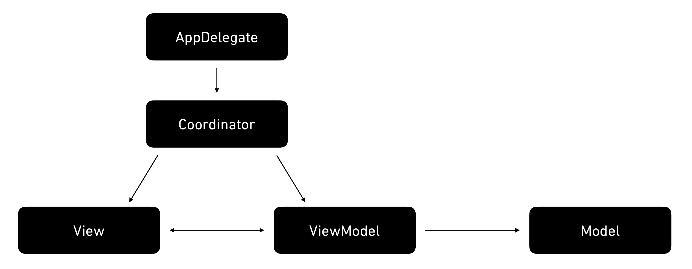

# Navigation

This library offers some convenience classes and protocols to implement the coordinator pattern. By design it is very flexible and doesn't constrain the implementation where it doesn't need to.

#### Contents:

- [Installation](#installation)
- [Usage](#usage)
- [Example](#example)
    - [Pure Swift + dependency injection](#pure-swift--dependency-injection)
    - [ReactiveSwift + Signals](#reactiveswift--signals)
- [Contribution](#contribution)

## Installation

### Swift Package Manager

#### Automatically in Xcode:

- Click **File > Swift Packages > Add Package Dependency...**  
- Use the package URL `https://github.com/nkristek/Navigation` to add Navigation to your project.

#### Manually in your `Package.swift` file:

```swift
.package(url: "https://github.com/nkristek/Navigation", from: "0.1.1")
```

## Usage

First of all, let's start with an issue I had with MVVM on iOS: 
Where should I instantiate a `UIViewController` or call methods like `navigationController.pushViewController(:animated:)`? The viewmodel should decide when a navigation should occur, but it certainly doesn't make sense to call these methods there or interact with `UIKit` directly in the viewmodel.

I decided to look into the coordinator pattern and came up with the following solution:

### Architecture



The coordinator is responsible for the view hierarchy and does not contain any business logic. To keep matters simple, the protocol should be very lightweight. This library proposes the following protocol:
```swift
public protocol Coordinator: AnyObject {
    associatedtype Route
    var rootViewController: UIViewController { get }
    func handle(route: Route)
}
```
- To display a coordinator hierarchy one simply has to show the given `rootViewController`, everything else is taken care of by the coordinator itself.
- To invoke a transition/navigation one has to call the `handle(route:)` method and passing in a route that contains all the information the coordinator needs to know what has to happen.

> Note: Since protocols with `associatedtype` are kind of hard to use without making heavy use of generics, there are extensions that erase the type to either `AnyCoordinator` (strong reference) or `UnownedCoordinator` (unowned reference) by using `eraseToAnyCoordinator` or `eraseToUnownedCoordinator` respectively. 

Let's imagine a screen that displays a list of items and a configuration button. After tapping an item or the configuration button, the respective transition should occur.
For reference, this shall be the protocol for this viewmodel:
```swift
protocol ItemListViewModelType {
    var items: [String] { get }
    func itemPressed(_ item: String)
    func configurationPressed()
}
```

### Route

For each viewmodel that "navigates", there should be a corresponding route. This route shall contain every piece of information needed, to perform the navigation, while staying completely UI and platform independent.

The corresponding route has to account for the two interactions, item pressed and connection pressed. Since enums are very powerful in Swift, let's use them for this task:

```swift
enum ItemListRoute {
    case item(String)
    case configuration(ConfigurationViewModelType)
}
```

### ViewModel

Whenever the viewmodel wants to perform a navigation (one of the input methods is called), it calls the `handle(route:)` method on a given coordinator.

> Note: Since the coordinator holds a strong reference to each viewcontroller and each viewcontroller holds a strong reference to the corresponding viewmodel, the viewmodel is **not** allowed to keep a strong reference to the coordinator to avoid **reference cycles**. 
Instead, the viewmodel shall receive an `UnownedCoordinator<Route>` (using `eraseToUnownedCoordinator`).

```swift
final class ItemListViewModel: ItemListViewModelType {
    private let coordinator: UnownedCoordinator<ItemListRoute>

    let items = ["First", "Second", "Third"]

    init(coordinator: UnownedCoordinator<ItemListRoute>) {
        self.coordinator = coordinator
    }
    
    func itemPressed(_ item: String) {
        coordinator.handle(route: .item(item))
    }
	
    func configurationPressed() {
        let viewModel = ConfigurationViewModel()
        coordinator.handle(route: .configuration(viewModel))
    }
}
```

If the `ConfigurationViewModel` itself performs navigation, just add this dependency as a separate coordinator parameter. Don't worry, both routes will be implemented by the same coordinator.

<details>
  <summary>Nested coordinator dependency</summary>

```swift
final class ItemListViewModel: ItemListViewModelType {
    private let coordinator: UnownedCoordinator<ItemListRoute>
    private let configurationCoordinator: UnownedCoordinator<ConfigurationRoute>

    let items = ["First", "Second", "Third"]

    init(coordinator: UnownedCoordinator<ItemListRoute>, 
         configurationCoordinator: UnownedCoordinator<ConfigurationRoute>) {
        self.coordinator = coordinator
        self.configurationCoordinator = configurationCoordinator
    }

    func itemPressed(_ item: String) {
        coordinator.handle(route: .item(item))
    }
	
    func configurationPressed() {
        let viewModel = ConfigurationViewModel(coordinator: configurationCoordinator)
        coordinator.handle(route: .configuration(viewModel))
    }
}
```

</details>

Great, now our viewmodel is done. As you can clearly see, we don't have any dependency on anything UI related anymore and since the coordinator implementation is easily mocked, it is very easy to test.

### Coordinator

Now let's get started with the coordinator implementation. First of all, since there probably will be multiple different routes that need to be handled, we'll define a more generic `AppRoute` which combines all those and provides an additional case for the starting route:
```swift
enum AppRoute {
    case start(ItemListViewModelType)
    case itemList(ItemListRoute)
    case configuration(ConfigurationRoute)
}
```

Now let's implement this route in the coordinator:
```swift
final class AppCoordinator: Coordinator {
    private let navigationController = UINavigationController()

    var rootViewController: UIViewController { navigationController }
    
    func handle(route: AppRoute) {
        switch route {
        case let .start(viewModel):
            let viewController = ItemListViewController(viewModel: viewModel)
            navigationController.setViewControllers([viewController], animated: false)

        case let .itemList(itemListRoute):
            switch itemListRoute {
            case let .item(item):
                let viewController = ItemViewController(item: item)
                navigationController.pushViewController(viewController, animated: true)

            case let .configuration(viewModel):
                let viewController = ConfigurationViewController(viewModel: viewModel)
                navigationController.pushViewController(viewController, animated: true)
            }

        case let .configuration(configurationRoute):
            // ...
        }
    }
}
```

There is also some syntactic sugar in form of a `StackNavigator<Route>` which provides more functionality regarding programatic pop behavior (e.g. popping back to a specific route):

<details>
  <summary>StackNavigator<Route></summary>
	  
```swift
final class AppCoordinator: Coordinator {
    private let navigator: StackNavigator<AppRoute>

    private let navigationController = UINavigationController()

    init() {
        navigator = StackNavigator(navigationController: navigationController)
    }

    var rootViewController: UIViewController { navigationController }

    func handle(route: AppRoute) {
        switch route {
        case let .start(viewModel):
            let viewController = ItemListViewController(viewModel: viewModel)
            navigator.set([(route: route, viewController: viewController)], animated: false)

        case let .itemList(itemListRoute):
            switch listRoute {
            case let .item(item):
                let viewController = ItemViewController(item: item)
                navigator.push(route: route, viewController: viewController, animated: true)

            case let .configuration(viewModel):
                let viewController = ConfigurationViewController(viewModel: viewModel)
                navigator.push(route: route, viewController: viewController, animated: true)
            }

        case let .configuration(configurationRoute):
            // ...
        }
    }
}
```

</details>

### AppDelegate

In `application(_:didFinishLaunchingWithOptions:)` we only need to instantiate the `AppCoordinator` and set its `rootViewController` to the `rootViewController` property of the window.
```swift
// instantiate the window
let window = UIWindow(windowScene: windowScene)
self.window = window

// instantiate the coordinator and keep a reference (holds our entire application hierarchy)
let coordinator = AppCoordinator()
self.coordinator = coordinator

// Start the coordinator with the first route
// pass in an unowned reference to the viewmodel with the appropriate transform to convert the ItemListRoute/ConfigurationRoute to AppRoute
let viewModel = ItemListViewModel(coordinator: coordinator.eraseToUnownedCoordinator(transform: AppRoute.itemList),
                                  configurationCoordinator: coordinator.eraseToUnownedCoordinator(transform: AppRoute.configuration))
coordinator.handle(route: .start(viewModel))

// set the rootViewController and display the window
window.rootViewController = coordinator.rootViewController
window.makeKeyAndVisible()
```

### Final notes

Congratulations, your MVVM-C application is up and running 🎉

Below there are a couple of examples on how to use this pattern reactively. Among other benefits, this has makes it possible to decouple the viewmodel and coordinator even further by using signals.

## Example
### Pure Swift + dependency injection

<details>
  <summary>AppDelegate</summary>
	
```swift
let window = UIWindow(windowScene: windowScene)
self.window = window

let coordinator = AppCoordinator()
self.coordinator = coordinator

let viewModel = ItemListViewModel(coordinator: coordinator.eraseToUnownedCoordinator(transform: AppRoute.itemList),
                                  configurationCoordinator: coordinator.eraseToUnownedCoordinator(transform: AppRoute.configuration))
coordinator.handle(route: .start(viewModel))

window.rootViewController = coordinator.rootViewController
window.makeKeyAndVisible()
```

</details>

<details>
  <summary>ViewModel</summary>
	
```swift
enum ItemListRoute {
    case item(String)
    case configuration(ConfigurationViewModelType)
}

protocol ItemListViewModelType {
    var items: [String] { get }
    func itemPressed(_ item: String)
    func connectionPressed()
}

final class ItemListViewModel: ItemListViewModelType {
    private let coordinator: UnownedCoordinator<ItemListRoute>
    private let configurationCoordinator: UnownedCoordinator<ConfigurationRoute>

    let items = ["First", "Second", "Third"]

    init(coordinator: UnownedCoordinator<ItemListRoute>, 
         configurationCoordinator: UnownedCoordinator<ConfigurationRoute>) {
        self.coordinator = coordinator
        self.configurationCoordinator = configurationCoordinator
    }

    func itemPressed(_ item: String) {
        coordinator.handle(route: .item(item))
    }
	
    func connectionPressed() {
        let viewModel = ConfigurationViewModel(coordinator: configurationCoordinator)
        coordinator.handle(route: .configuration(viewModel))
    }
}
```

</details>

<details>
  <summary>Coordinator</summary>
	
```swift
enum AppRoute {
    case start(ItemListViewModelType)
    case itemList(ItemListRoute)
    case configuration(ConfigurationRoute)
}

final class AppCoordinator: Coordinator {
    private let navigator: StackNavigator<AppRoute>

    private let navigationController = UINavigationController()

    init() {
        navigator = StackNavigator(navigationController: navigationController)
    }

    var rootViewController: UIViewController { navigationController }

    func handle(route: AppRoute) {
        switch route {
        case let .start(viewModel):
            let viewController = ItemListViewController(viewModel: viewModel)
            navigator.set([(route: route, viewController: viewController)], animated: false)

        case let .itemList(itemListRoute):
            switch listRoute {
            case let .item(item):
                let viewController = ItemViewController(item: item)
                navigator.push(route: route, viewController: viewController, animated: true)

            case let .configuration(viewModel):
                let viewController = ConfigurationViewController(viewModel: viewModel)
                navigator.push(route: route, viewController: viewController, animated: true)
            }

        case let .configuration(configurationRoute):
            // ...
        }
    }
}
```

</details>

### ReactiveSwift + Signals

<details>
  <summary>AppDelegate</summary>
	
```swift
let window = UIWindow(windowScene: windowScene)
self.window = window

let coordinator = AppCoordinator()
self.coordinator = coordinator

let viewModel = ItemListViewModel()
coordinator.handle(route: .start(viewModel))

window.rootViewController = coordinator.rootViewController
window.makeKeyAndVisible()
```

</details>

<details>
  <summary>ViewModel</summary>
	
```swift
enum ItemListRoute {
    case item(String)
    case configuration(ConfigurationViewModelType)
}

protocol ItemListViewModelType {
    var navigationSignal: Signal<ItemListRoute, Never> { get }
    var items: Property<[String]> { get }
    var itemPressedObserver: Signal<String, Never>.Observer { get }
    var connectionPressedObserver: Signal<Void, Never>.Observer { get }
}

final class ItemListViewModel: ItemListViewModelType {
    private let (lifetime, token) = Lifetime.make()
    let (navigationSignal, navigationObserver) = Signal<ItemListRoute, Never>.pipe()
    let items = Property(value: ["First", "Second", "Third"])
    let (itemPressedSignal, itemPressedObserver) = Signal<String, Never>.pipe()
    let (connectionPressedSignal, connectionPressedObserver) = Signal<Void, Never>.pipe()

    init() {
        lifetime += itemPressedSignal
            .map(ItemListRoute.item)
            .observe(navigationObserver)
		
        lifetime += connectionPressedSignal
            .map { _ in
                let viewModel = ConfigurationViewModel()
                return .configuration(viewModel)
            }
            .observe(navigationObserver)
    }
}
```

</details>

<details>
  <summary>Coordinator</summary>
	
```swift
enum AppRoute {
    case start(ItemListViewModelType)
    case itemList(ItemListRoute)
    case configuration(ConfigurationRoute)
}

final class AppCoordinator: Coordinator, ReactiveExtensionsProvider {
    private let navigator: StackNavigator<AppRoute>

    private let navigationController = UINavigationController()

    init() {
        navigator = StackNavigator(navigationController: navigationController)
    }

    var rootViewController: UIViewController { navigationController }

    func handle(route: AppRoute) {
        switch route {
        case let .start(viewModel):
            let viewController = ItemListViewController(viewModel: viewModel)
            reactive.handle <~ viewModel.navigationSignal
			    .take(duringLifetimeOf: viewController)
			    .map(AppRoute.itemList)
            navigator.set([(route: route, viewController: viewController)], animated: false)

        case let .itemList(itemListRoute):
            switch listRoute {
            case let .item(item):
                let viewController = ItemViewController(item: item)
                navigator.push(route: route, viewController: viewController, animated: true)

            case let .configuration(viewModel):
                let viewController = ConfigurationViewController(viewModel: viewModel)
                reactive.handle <~ viewModel.navigationSignal
				    .take(duringLifetimeOf: viewController)
				    .map(AppRoute.configuration)
                navigator.push(route: route, viewController: viewController, animated: true)
            }

        case let .configuration(configurationRoute):
            // ...
        }
    }
}
```

</details>

## Contribution

If you find a bug feel free to open an issue. Contributions are also appreciated.
